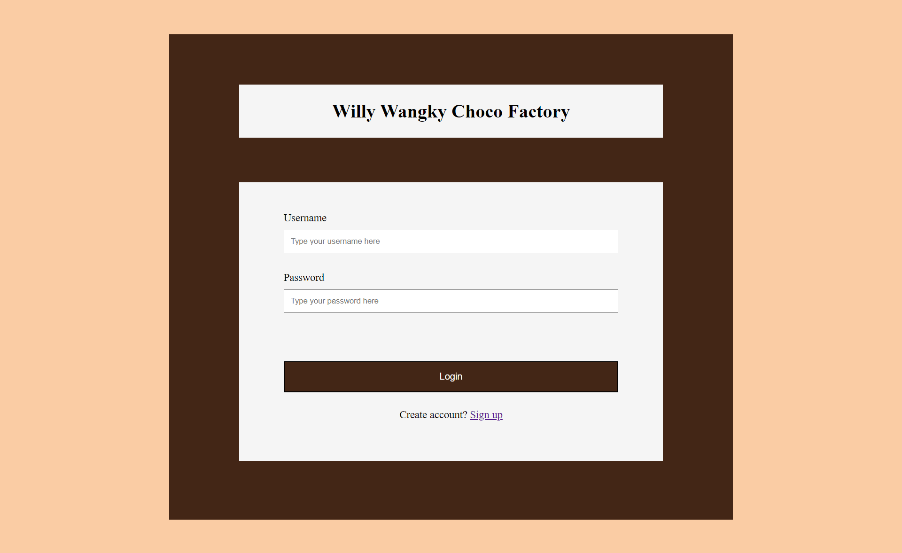
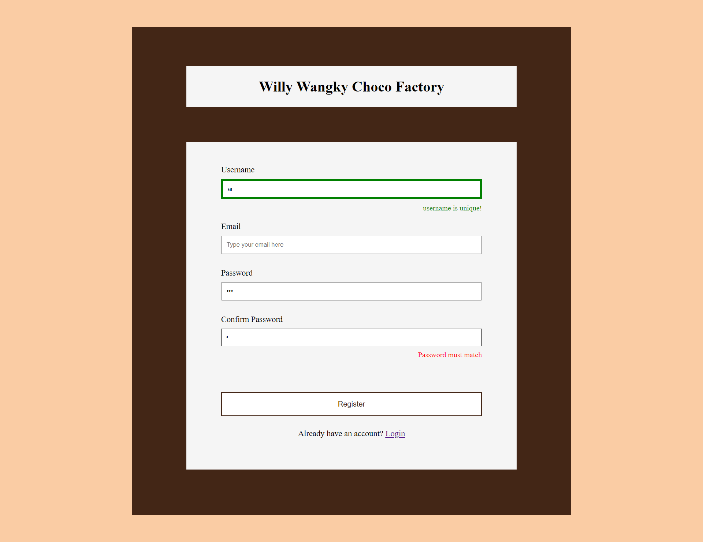
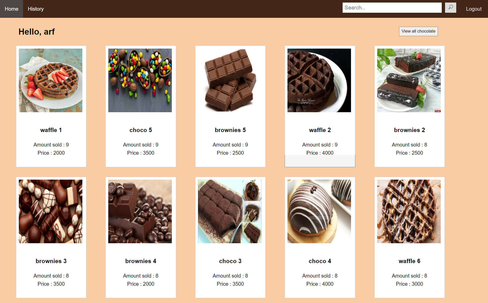
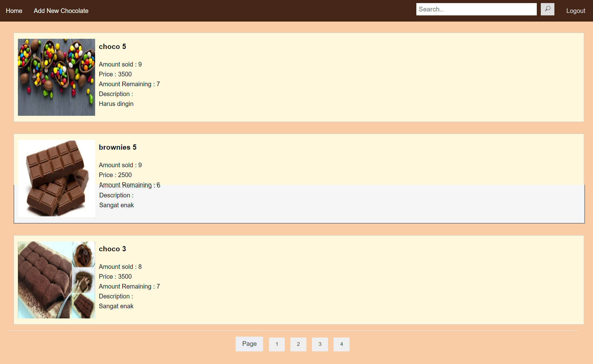
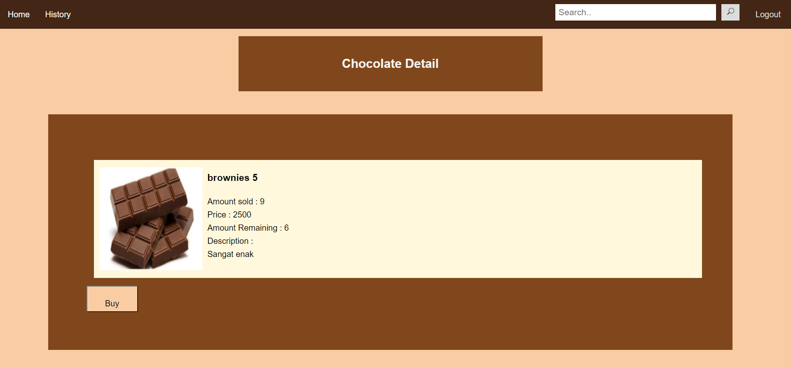
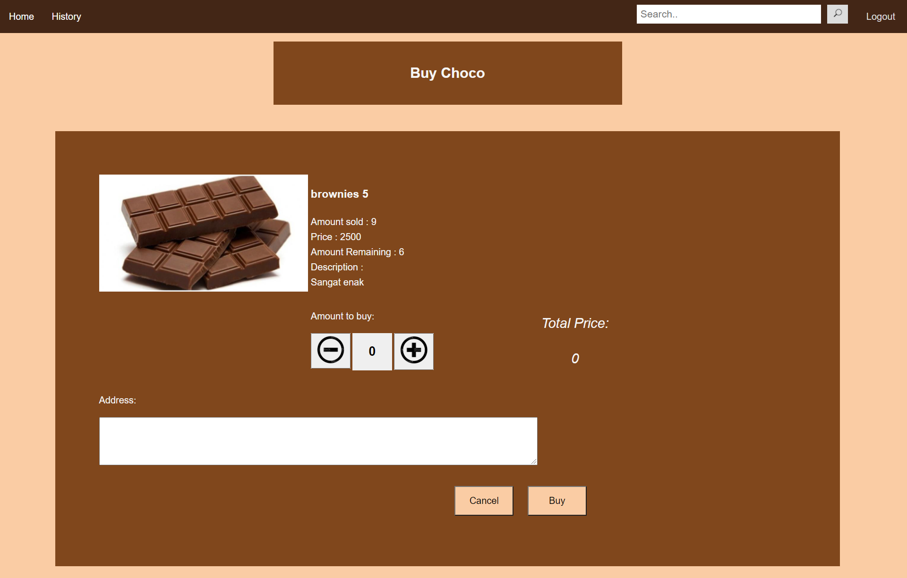
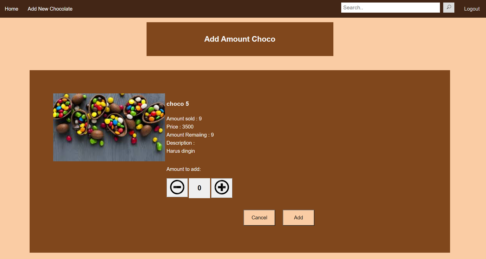
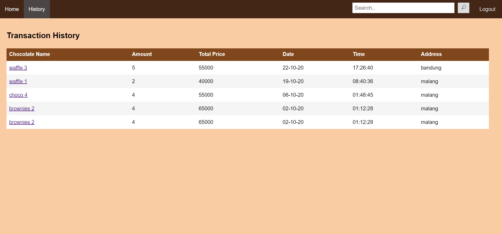

# Deskripsi Aplikasi Web
Aplikasi web ini digunakan oleh Willy Wangky Chocolate Factory untuk menghubungkan admin Willy Wangky dengan pembeli coklat pada penjualan daring. Web ini dapat diakses oleh dua jenis akun: user dan superuser. User adalah pembeli coklat, dan superuser adalah admin dari Willy Wangky yang dapat menambahkan coklat ke database.

Terdapat halaman register, login, dashboard untuk menampilkan daftar coklat, pencarian coklat, dan laman untuk menampilkan detail coklat. Setelah login/register, akun bertipe user dapat mengakses pembelian coklat dan laman riwayat transaksi, sementara akun bertipe superuser dapat melakukan penambahan stock coklat dan mengakses laman penambahan coklat baru. Pengguna tidak dapat mendaftar sebagai superuser, karena superuser ditambahkan secara manual pada basis data. Pada basis data, Type super user adalah 0 sementara type user adalah 1.

Masa berlaku akses akun maksimal adalah 24 jam. Setelah itu, pengguna harus melakukan login ulang untuk kembali mengakses web. Web juga memfasilitasi pilihan untuk logout dari akun jika telah selesai mengakses web.

# Daftar Requirements
1. Sistem dapat melakukan register untuk pengguna
2. Sistem dapat melakukan login untuk pengguna
3. Sistem dapat melakukan pencarian chocolate
4. Sistem dapat menampilkan detail chocolate yang akan dibeli
5. Sistem dapat melakukan transaksi jual beli produk
6. Sistem dapat menampilkan histori pembelian produk
7. Sistem dapat menambahkan produk chocolate yang akan dijual
8. Sistem dapat menambahkah jumlah stock produk yang tersedia

# Prerequisites
1. PHP
2. MySql
3. Browser support JavaScript

# Cara Instalasi
1. Clone repository gitlab
2. Masuk ke folder App
3. Import database choc.sql pada folder Database
4. Buka folder Controller/logreg
5. Buka config.php
6. Sesuaikan host, user database, password database, dan nama database pada config.php
7. Jalankan server dan MySql Xampp

# Cara Menjalankan Server
1. Buka Command Prompt
2. Arahkan ke folder App
3. Ketik “php -S localhost:8000”
4. Enter 
5. Jalankan URL yang ditampilkan pada command prompt

# Screenshot Tampilan Aplikasi

## Login & Register Page
### Login

### Register

## Dashboard & Search Result 
### User

### Superuser

### Search Result

## Choco Detail
### User

### Superuser
![add detail] (layar/choco_detail_admin.png)

## Buy Chocolate 

## Add chocolate 

### Success add page

## History

## Add New Chocolate

# Pembagian Tugas
## Frontend
1. Login: 13518089
2. Register: 13518089
3. Dashboard: 13518096
4. Search Result: 13518096
5. Histori Transaksi: 13518096
6. Choco Detail: 13518053
7. Buy Choco: 13518053
8. Add Stock Choco: 13518053
10. Add New Chocolate: 13518089
## Backend
1. Login: 13518089
2. Register: 13518089
3. Dashboard: 13518096
4. Search Result: 13518096
5. Histori Transaksi: 13518096 
6. Choco Detail: 13518053
7. Buy Choco: 13518053
8. Add Stock Choco: 13518053
10. Add New Chocolate: 13518089
 
## Database
13518053, 13518089, 13518096