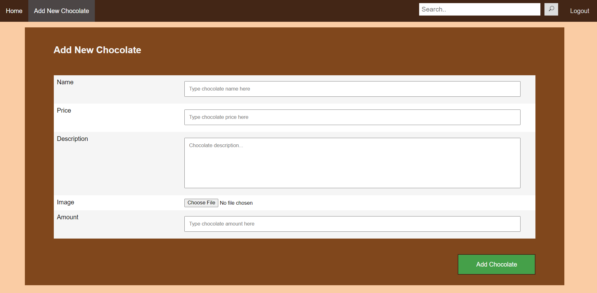

# Deskripsi Aplikasi Web
Aplikasi web ini digunakan oleh Willy Wangky Chocolate Factory untuk menghubungkan admin Willy Wangky dengan pembeli coklat pada penjualan daring. Web ini dapat diakses oleh dua jenis akun: user dan superuser. User adalah pembeli coklat, dan superuser adalah admin dari Willy Wangky yang dapat menambahkan coklat ke database.

Terdapat halaman register, login, dashboard untuk menampilkan daftar coklat, pencarian coklat, dan laman untuk menampilkan detail coklat. Setelah login/register, akun bertipe user dapat mengakses pembelian coklat dan laman riwayat transaksi, sementara akun bertipe superuser dapat melakukan penambahan stock coklat dan mengakses laman penambahan coklat baru. Pengguna tidak dapat mendaftar sebagai superuser, karena superuser ditambahkan secara manual pada basis data. Pada basis data, Type super user adalah 0 sementara type user adalah 1.

Masa berlaku akses akun maksimal adalah 24 jam. Setelah itu, pengguna harus melakukan login ulang untuk kembali mengakses web. Web juga memfasilitasi pilihan untuk logout dari akun jika telah selesai mengakses web.

# Basis Data
Tidak terdapat perubahan pada basis data di Willy Wangky’s Web.

# Daftar Requirements
1. Sistem dapat melakukan register untuk pengguna
2. Sistem dapat melakukan login untuk pengguna
3. Sistem dapat melakukan pencarian chocolate
4. Sistem dapat menampilkan detail chocolate yang akan dibeli
5. Sistem dapat melakukan transaksi jual beli produk
6. Sistem dapat menampilkan histori pembelian produk
7. Sistem dapat menambahkan produk chocolate yang akan dijual beserta resepnya
8. Sistem dapat menambahkah jumlah stock produk yang tersedia dengan mengirimkan request ke Web Service Factory

# Prerequisites
1. PHP
2. MySql
3. Browser support JavaScript

# Cara Instalasi
1. Clone repository gitlab
2. Masuk ke folder App
3. Import database choc.sql pada folder Database
4. Buka folder Controller/logreg
5. Buka config.php
6. Sesuaikan host, user database, password database, dan nama database pada config.php
7. Jalankan server dan MySql Xampp

# Cara Menjalankan Server
1. Buka Command Prompt
2. Arahkan ke folder App
3. Ketik “php -S localhost:8000”
4. Enter 
5. Jalankan URL yang ditampilkan pada command prompt

# Screenshot Perubahan Tampilan Aplikasi

## Add New Chocolate
### Sebelum

### Sesudah

## Add chocolate 
### Sebelum

### Sesudah

# Pembagian Tugas
## REST
Melakukan transaksi bahan dengan Factory Management Pro.
- Input yang diberikan adalah jumlah uang yang dimiliki, daftar bahan yang ingin dibeli beserta jumlahnya.
- Apabila uang cukup, layanan memberikan respon jumlah uang hasil transaksi beserta status berhasil.
- Apabila uang tidak cukup, layanan memberikan respon jumlah uang yang kurang agar transaksi berhasil beserta status gagal : 13518053
Memberikan daftar bahan yang dijual. 
- Menerima request dari Factory Management Pro : 13518096
- Mengembalikan data berisi daftar bahan-bahan yang ada. Bisa beserta harga dan bisa tanpa harga 13518089
## SOAP
Menambahkan jenis coklat baru beserta resep (kebutuhan bahan) 13518096
Menambahkan permintaan add stock baru : 13518089
Mengembalikan status dari permintaan add stock : 13518089
Melakukan pembuatan coklat tertentu dengan jumlah tertentu, yaitu mengubah bahan tidak kedaluwarsa dalam stok gudang Factory menjadi coklat (yang masih berada dalam gudang Factory) dan mengurangi bahan dalam gudang apabila bahan cukup : 13518096
Mengubah status permintaan add stock, dalam artian melakukan pengiriman terhadap toko Willy Wangky : 13518096
Menambah saldo yang dimiliki pada Factory : 13518053
Mengembalikan saldo yang dimiliki pada Factory : 13518053
Menambahkan bahan dalam gudang : 13518096

## ReactJS
1. Navigasi/main page : 13518089
2. Memberikan approval terhadap pesanan coklat dari WWWeb. Ketika pesanan diberikan approval, maka status pesanan akan diubah dari pending menjadi delivered. Setelah itu, Aplikasi akan mengirim permintaan ke WS-Factory untuk menambah stok coklat pabrik.: 13518089
3. Melihat daftar pemesanan coklat dari WWWeb : 13518089
4. Melihat daftar bahan yang tersedia di pabrik : 13518053
5. Melihat daftar harga bahan yang tersedia di supplier : 13518053
6. Membeli bahan dari supplier : 13518053
7. Melihat daftar resep coklat : 13518096
8. Melihat daftar coklat yang tersedia di pabrik : 13518096
9. Melihat saldo pabrik : 13518096
## Perubahan Willy Wangky’s Web
1. Penambahan stok coklat tidak bisa dilakukan secara langsung, namun harus mengirim request terlebih dahulu kepada web service Factory : 13518089
2. Dikarenakan stok coklat pada toko Willy Wangky hanya bertambah jika request kepada 
3. Factory telah diterima, maka aplikasi Willy Wangky harus mengecek status request secara berkala ke web service Factory. Jika status request sudah Delivered, maka request sudah selesai dan aplikasi Willy Wangky menambah stok ke dalam basis data : 13518089
4. Pembuatan coklat yang baru harus menambah data berupa daftar material yang dibutuhkan, dimana list material yang mungkin diterima dari web service supplier. Tampilan juga harus menampilkan harga total dari material yang ada agar superuser dapat memikirkan margin yang baik untuk harga coklat tersebut : 13518053
5. Pembuatan coklat yang baru harus mengirim request ke web service Factory agar web service Factory tahu resep yang dibutuhkan untuk suatu coklat : 13518096
6. Setiap penjualan coklat, aplikasi harus memanggil request pada web service Factory untuk menambah saldo : 13518053

## Database
13518053, 13518089, 13518096
